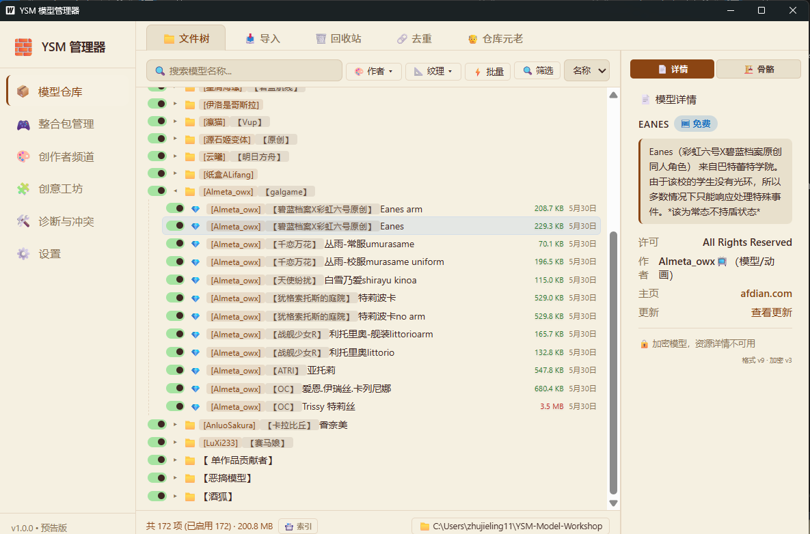
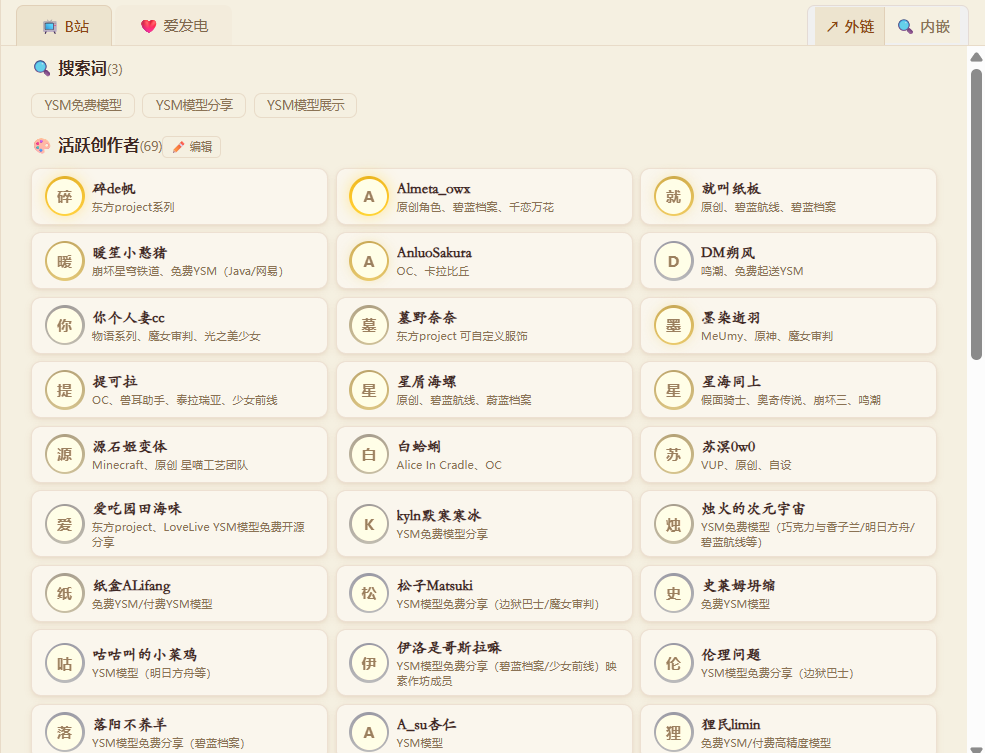
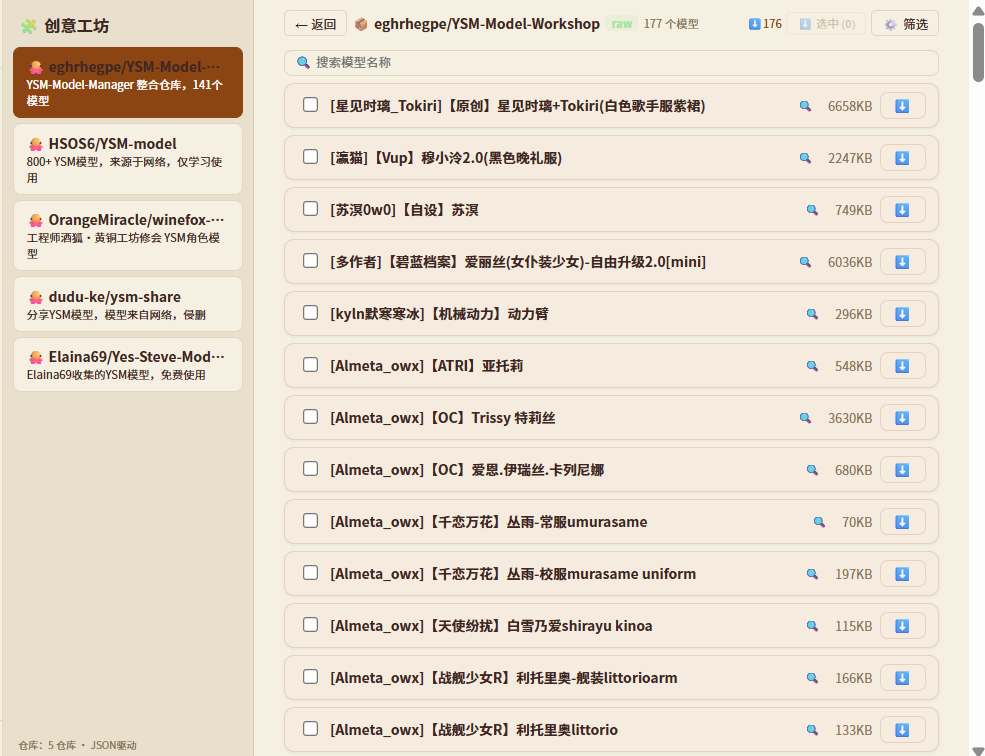
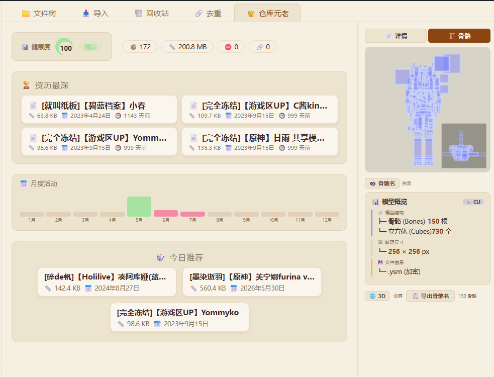
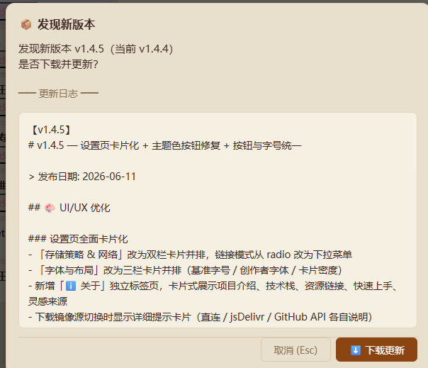
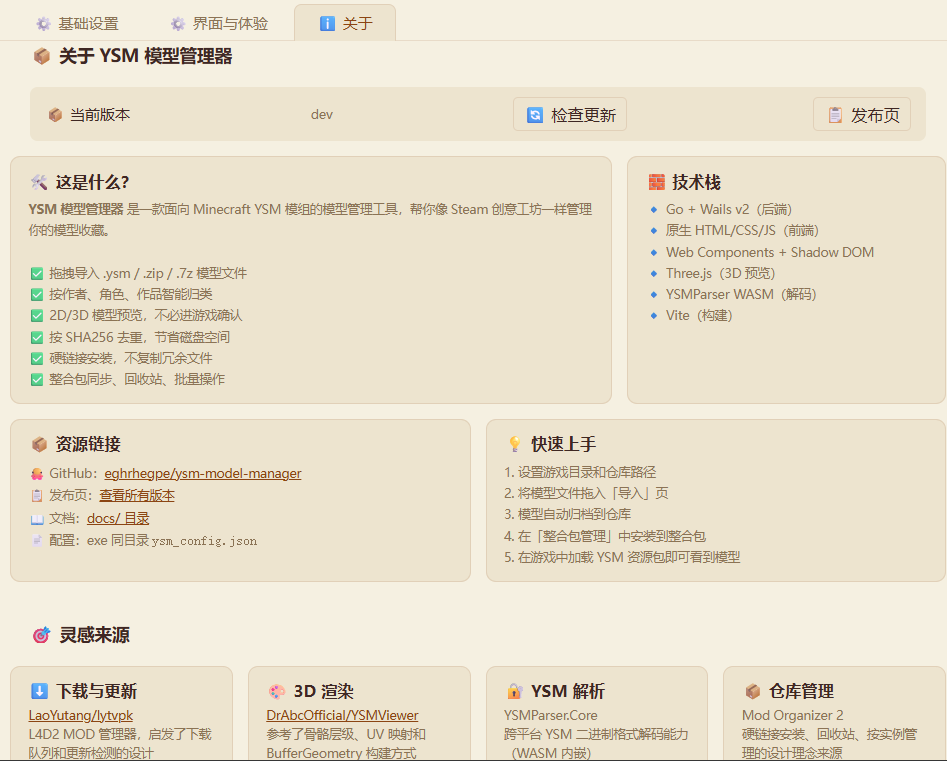

# 🧱 YSM 模型管理器

> > 像 Steam 创意工坊一样，管理你的 Minecraft YSM 模型。
> > [https://eghrhegpe.github.io/ysm-model-manager/](https://eghrhegpe.github.io/ysm-model-manager/)

**技术栈**：Go (Wails v3) + 原生 HTML/CSS/TS (Web Components + Shadow DOM) + Three.js + YSMParser WASM

**✅ Windows (amd64) · ✅ Linux (amd64) · ⚠️ macOS (实验性)** 具备完整的导入、预览、分类、同步功能。

**✅Android「3D预览器」** 授权公共仓库路径后， `os.*` 直读模型文件。

**✅网页版「3D预览器」** 经 backend 适配器路由到 IndexedDB 模型库（`resolveBackend` 双实现）。

---

## ⚡ 快速开始

1. **下载**： [GitHub Releases](https://github.com/eghrhegpe/ysm-model-manager/releases) 的 `YSM-Model-Manager_windows_amd64.exe`
2. **解压**：解压到任意目录（如 `D:\YSM-Model-Manager\`）
3. **首次配置**：启动程序 → 设置游戏根目录（`.minecraft` 文件夹）→ 设置模型仓库路径
4. **开始使用**：把模型文件放入仓库目录，或通过拖拽导入

> 📖 **详细说明见 [用户指南](docs/guide/index.md)**，包含 FAQ、故障排查、链接模式详解等。
> 🎨 **设计规范见 [Design.md](docs/Design.md)**， 包含 UI 设计指南。
> 🧭 **主站介绍见 [docs/index.md](docs/index.md)**，包含 项目进展。
> AI 协作规则见 [AGENTS.md](AGENTS.md)。

---

## 🖥️ 功能一览

左侧导航 → 右侧主区域，共 7 个功能模块：

| 导航          | 功能                                           |
| ------------- | ---------------------------------------------- |
| 🎲 3D 预览    | 直接看 YSM、车万女仆、MMD、PMX、VRM、FBX、Litematic、蓝图、投影模型 |
| 📦 模型仓库   | 树形浏览、启用/禁用、搜索排序、3D 预览         |
| 🎮 整合包管理 | 版本列表、同步状态、快捷安装                   |
| 🎨 创作者频道 | 创作者浏览、渐变头像、预设搜索、内嵌浏览器     |
| 🧩 创意工坊   | GitHub 在线仓库列表、一键下载                  |
| 👴 仓库元老   | 健康度评分、资历最深、月度热力图、今日推荐     |
| 🛠️ 诊断与冲突 | 操作日志、模型去重（可选保留）、冲突检测       |
| ⚙️ 设置       | 卡片化设置、"关于"主页、主题与字体配置         |

---

## ✅ 功能

### 📦 模型仓库

<p align="center"></p>

- 扫描9类模型文件，支持`.zip` / `.7z` 按 SHA256 去重）
- 树形文件夹浏览 + 拖拽即移动
  p`/`.7z` （按 SHA256 去重）
- 树形文件夹浏览 + 拖拽即可导入到当前仓库页。
- 搜索高亮 + 多字段排序（名称 / 大小 / 日期）
- 文件大小颜色：<1MB 绿色，1~3MB 默认，>3ban红色
- 日期美化（今天显示时间，今年显示月日，往年显示完整日期）
- 启用 / 禁用切换（`.ban` 后缀），复选框批量操作
- 文件夹开关（全部启用 / 全部禁用 / 混合翻转）
- 右键菜单：禁用/启用、模型详情、打开文件夹
- 📇 **生成 GitHub 索引**：扫描仓库生成 `index.json`，提交后即可在线浏览

### 🎮 整合包管理

<p align="center"></p>

- 🔍 自动搜索：列出所有 MC 实例，支持多种启动器布局：
  - 标准 `.minecraft/versions/`（原版/PCL2/HMCL/BakaXL）
  - PrismLauncher `instances/{name}/.minecraft/` 或 `minecraft/`
- 检测 YSM 模组，无 YSM 的整合包显示 🚫 无YSM 但仍可管理
- 四类同步状态：
  - ✅ **已同步的模型列表** — 仓库有且已安装
  - ⬇️ **待同步的模型列表** — 仓库有但未安装
  - ⚠️ **已禁用** — 仓库已禁用但已安装
  - 📤 **可加入仓库的模型列表** — 整合包有但仓库无
- 批量安装缺失 + 单个安装按钮
- 卡片展开/折叠持久化（`localStorage`）
- 搜索 + YSM 模组筛选，有 YSM 优先
- 右键菜单：从仓库导入、复制模型清单、清空整合包

### 🔄 同步与安装

- 三种安装模式：📋 复制 / 🔗 硬链接（推荐） / 🔗 符号链接（不推荐）
- 批量安装缺失 / 上传新模型到仓库
- **文件监听器**（`fsnotify`）：仓库文件加/删 `.disabled` 时自动同步到所有整合包，无需手动操作
- 状态同步：仓库启用/禁用 → 自动同步到所有整合包 custom 目录
- 禁用模型自动隐藏（不出现在缺失列表），已安装自动加 `.ban`
- 硬链接跨分区自动降级为复制
- 游戏运行时文件被锁定自动跳过，退出后下次触发自动重试

### 🎨 创作者频道

<p align="center"></p>

- **站点浏览**：B站、爱发电等平台的创作者列表浏览
- **创作者管理**：维护创作者数据库（231+ 位），按平台标签分类（bilibili / afdian / github）
- **渐变头像边框**：作品数越高边框越亮，conic-gradient 渐变 + 呼吸灯动画
- **预设搜索**：一键搜索 B站 YSM 免费模型 / YSM 模型分享、爱发电 YSM
- **内嵌/外链模式**：pill 式切换开关，tab 栏右侧
- **导入/导出**：站点和创作者 JSON 导入导出，支持合并和覆盖模式

### 🧩 创意工坊

<p align="center"></p>

- **GitHub 在线仓库**：读取远程仓库的 `index.json` 在线浏览模型列表
- **一键下载**：⬇️ 直接从 GitHub 下载模型到本地仓库
- **仓库管理**：支持添加/删除 GitHub 仓库源

### 👴 仓库元老

<p align="center"></p>

- **健康度评分**：综合禁用率和重复率计算（100 分制），conic-gradient 环形展示 + 呼吸动画
- **月度活动热力图**：一年 12 个月的活动分布一目了然
- **资历最深**：仓库中最早创建的 10 个模型
- **今日推荐**：每日随机推荐一个模型

### 🔄 自动更新

<p align="center"></p>

- 启动时自动检查 GitHub Releases（6 小时限频）
- 检测到新版本右下角 toast 提示，点击弹出更新确认
- 聚合显示所有跳过的版本更新日志
- Go 原生替换：os.Rename 备份 + 解压覆盖，无黑框

### 🛠️ 诊断与冲突

- **操作日志**：所有安装/导入/删除操作 + 失败原因分行显示
- **模型去重**：仓库内按 SHA256 查重，**逐组选择保留哪个副本**，其余入回收站
- **冲突检测**：扫描同名文件存在于多个整合包

### ⚙️ 设置

<p align="center"></p>

- **卡片化布局**：存储策略 & 下载镜像双栏并排，字体与布局三栏并排
- 🎮 游戏根目录 — 📂 选择 / 🔍 自动搜索 `.minecraft`（检测 versions/assets 等特征）
- 📁 模型仓库路径 — 📂 选择
- 🔗 链接模式 — 下拉菜单选择（复制 / 硬链接 ✅ / 符号链接 ❌），切换后自动重新链接
- 🌐 下载镜像源 — 直连 / jsDelivr CDN / GitHub API，切换时显示详细提示
- 🌙 主题模式 — 💻 跟随系统 / 🌙 赛博霓虹 / ☀️ 温暖木纹 / ⚪ 极简深邃
- 🗑️ 回收站 — 列出/恢复/删除/清空（符号链接直接删、硬链接直接删、普通文件移入 `.recycle`）
- 导航状态持久化（启动恢复上次页面）
- 窗口大小/位置记忆（关闭时 Go 端保存）

### ℹ️ 关于

<p align="center"></p>

- 卡片式展示项目定位、技术栈、资源链接
- **快速上手**五步指引：设置目录 → 拖入模型 → 自动归档 → 安装到整合包 → 加载资源包
- **灵感来源**：lytvpk（下载）、YSMViewer（3D 渲染）、YSMParser（解析）、Mod Organizer 2（仓库管理）

### 🔒 安全

- **文件导入校验**：魔数（ZIP/7z）、文件大小上限 500MB、路径穿越防护
- **路径安全**：统一 `paths.IsInside()` 用 `EvalSymlinks` 真实路径校验
- **回收站安全**：硬链接/符号链接识别 + 路径遍历防护
- **shutdown 保护**：关闭时 `defer recover()` 防止窗口尺寸读取 panic

### 🧭 CLI 命令行模式

- 脱离 GUI 的全量命令行操作（39 个顶层命令，清单见 `docs/cli-commands.md`）：扫描 / 搜索 / 安装 / 同步 / 去重 / 回收站 / 工坊 / 标签 / 配置等
- **性能诊断**：`file-bench` / `single-bench` / `concurrent-bench` 定位加载瓶颈；`analyze-mmd` 分析模型结构
- **缓存治理**：`cache-status` / `cache-verify` / `cache-clear` 管理纹理缓存

### 🏷️ 标签系统

- 给模型打标签（`tags` 命令 + 界面操作），关键词 + 标签 + 数值范围**三路交集搜索**

### 🖼️ 纹理缓存

- 3D 预览纹理压缩为 KTX2 缓存（`go/texture_cache`），显著降低加载耗时与内存占用

---

# 🔬 技术原理：

## Blockbench 模型

YSM、车万女仆 模型基于 **Blockbench** 格式（`.geo.json`），使用 Minecraft 基岩版（Bedrock）的骨骼系统与立方体网格。项目完整支持该格式的解析与渲染。

### 动画系统

`.animation.json` 文件采用基岩版动画格式，包含骨骼旋转/位移/缩放关键帧。项目实现完整动画管线：

- **解析引擎**：`parseBedrockAnimationJSON` 解析动画 JSON，支持 loop、animation_length、bones 三通道关键帧
- **关键帧插值**：支持线性（linear）、阶梯（step）、Catmull-Rom 三种插值模式
- **Molang 表达式求值**：内嵌 [molangjs](https://github.com/JannisX11/molangjs) 源码（MIT 许可，Blockbench 官方依赖），将 `.animation.json` 中的 Molang 字符串编译为 `(animTime: number) => number` 求值闭包
  - 安全口径：DSL 解析器非 `eval`，表达式不解释执行
  - 性能口径：LRU 缓存 400 条，加载期编译 AST，运行期纯求值
  - 变量上下文：`query.anim_time` / `q.anim_time`、`query.life_time` 等；未知变量优雅降级为 0
- **动画控制器**：解析 `.animation_controllers.json`，支持状态机转换（Molang 条件）、on_exit 动作、blend_transition 淡入淡出
- **旋转口径**：度→弧度 + X/Y 取负、Z 不取负（对齐上游 ModernYSM/TLM 共同口径）

## .ysm 文件组成

`.ysm` 是 YSM 模组的专有模型格式，**不是标准 zip 压缩包**。其结构为：

```
┌──────────┬────────┬──────────┬──────────────────────────────┐
│ YSGP头   │ 版本号 │ MD5校验  │  AES-256 加密的模型数据       │
│ (4字节)  │ (4字节)│ (16字节) │  (模型JSON + 纹理 + 动画)    │
└──────────┴────────┴──────────┴──────────────────────────────┘
```

- 开源模型以标准 `.zip` 格式分发，内含明文 `minecraft:geometry` JSON
- 加密模型使用 YSGP 二进制格式 + AES 加密，需专用解析器解码

### YSMParser 集成

本工具集成 [YSMParser](https://github.com/OpenYSM/YSMParser) 用于解码加密 .ysm 模型：

- **解码流程**：优先通过 **内嵌 WASM** 直接在浏览器中解码（`YSMParser.wasm` + 胶水代码），失败时降级调用 CLI `YSMParser.exe` 子进程（开发调试用）
- **WASM 内嵌**：WASM 二进制以 base64 编码打包在 `ysm-wasm-data.js` 中，无需额外下载，启动即加载；桌面 / Android / 网页版共用同一套注入（ADR-029）
- **兼容性**：支持数组 `[u,v]` 和对象 `{face:{uv,uv_size}}` 两种 UV 格式
- **隐私声明**：解码仅在本地进行，不联网、不存储、不导出模型文件

## Three.js 渲染器

项目使用 **Three.js** 作为 3D 渲染核心，支持多种模型格式的实时预览。

### 渲染管线

```
YSM 文件 → [解码层] → BedrockModel JSON → [Go spec 层] → Three.js Spec JSON → [前端渲染层] → Three.js Scene
```

- **解码层**：YSMParser WASM（前端）或 Go `AnalyzeBedrockModel`（桌面）
- **Go spec 层**：`threejs.Build()` 是骨骼坐标计算的**唯一事实来源**，输出 positions/normals/uvs/indices 格式
- **前端渲染层**：`model3d.ts` 消费 Go spec 构建 Three.js 场景（骨骼层级 + cube mesh + 纹理）

### 支持的模型格式

| 格式 | 适配器 | 底层库 | 特殊能力 |
|------|--------|--------|----------|
| YSM | `ysm-adapter.ts` | Go `GetModel3DSpec` | 骨骼组树 + cube mesh + 感知层 |
| VRM | `vrm-adapter.ts` | `@pixiv/three-vrm` + `GLTFLoader` | SpringBone / lookAt / 表情 / VRMA 动画 |
| MMD | `mmd-adapter.ts` | `@moeru/three-mmd` | PMX 物理（Ammo.js）/ VMD 动画 / KTX2 纹理 |
| Litematic | `litematic-adapter.ts` | 自研 voxel mesh | 分层控制 / 方块统计 |
| FBX | `fbx-adapter.ts` | `FBXLoader` | 静态模型预览 |

### 场景能力

项目实现可扩展的场景能力注册表（`SceneCapability`），8 个能力按注册顺序创建：

1. **天空**：Preetham 大气散射
2. **地面**：平面网格
3. **环境**：HDR IBL + PMREMGenerator
4. **雾效**：FogExp2
5. **阴影**：PCFSoftShadowMap
6. **反射**：Reflector
7. **后处理**：Bloom / SSAO / SSR
8. **灯光**：环境光 + 方向光 + 体积光

新增格式 = 加一个适配器 + 注册表一条目，所有适配器零改动继承全部能力。

### 感知层（程序化生命力）

让模型「活起来」的自主行为子系统：呼吸微位移、周期性眨眼、头部/眼球追踪相机、音频口型同步、BPM 节拍律动。

---

```
ysm-model-manager/
├── main.go                    ← Go 入口 + 窗口参数
├── wails.json                 ← Wails 配置
├── internal/app/              ← Wails Binding 入口（app.go 及按域拆分）
├── go/                        ← Go 工具包
│   ├── installer/             —— 模型安装（复制/硬链接/符号链接）
│   ├── recycle/               —— 回收站
│   ├── sync/                  —— 整合包同步状态
│   ├── logs/                  —— 操作日志
│   ├── ysm/                   —— YSM 模型解析 + 摘要提取 + 头部扫描
│   ├── threejs/               —— 3D 骨骼数据构建
│   ├── watcher/               —— 文件监听器（fsnotify 实时同步 .disabled/.ban）
│   ├── updater/               —— 自动更新
│   ├── version/               —— 版本号（编译时注入）
│   ├── paths/                 —— 路径安全校验
│   └── types/                 —— 共享类型
├── scripts/                   ← 构建/发布/工具脚本
│   ├── build-release.ps1      —— 构建+GitHub Release 脚本
│   ├── build-release.sh       —— 跨平台 bash 版发布脚本
│   ├── android-build.mjs      —— 安卓打包
│   └── android-install.mjs    —— 安卓安装
├── frontend/                  ← 前端源码
│   ├── index.html             —— 桌面/网页版主 UI
│   ├── web.html               —— 网页版 Spike 入口
│   ├── vite.web.config.ts     —— 网页版构建配置
│   ├── css/
│   │   ├── variables.css      —— CSS 变量（4 套主题 + 字体系统）
│   │   ├── layout.css         —— 主布局 + 侧栏
│   │   ├── components.css     —— 全局组件样式（部分已迁移至 Shadow DOM）
│   │   └── transitions.css    —— 过渡动画
│   └── src/
│       ├── bus.ts              —— 事件总线（跨 Shadow DOM 通信）
│       ├── app-modules.ts      —— 全局入口 + 右键菜单映射
│       ├── backend/            —— Wails/browser/android 后端适配（resolveBackend 双实现）
│       ├── views/              —— Web Components（Shadow DOM）
│       │   ├── app-nav/        —— 左侧导航菜单
│       │   ├── app-content/    —— 主内容区（页面路由 + 全局事件）
│       │   ├── app-tree/       —— 模型仓库树
│       │   ├── app-sidebar/    —— 整合包列表
│       │   ├── app-preview/    —— 预览面板 + 3D/2D 渲染
│       │   ├── app-sync-manager/ —— 同步管理
│       │   ├── app-toast/      —— Toast 通知
│       │   └── context-menu/   —— 右键菜单
│       ├── features/           —— 业务功能（import-dnd / recycle-bin / version-updater 等）
│       ├── core/               —— 基础设施（context-menus / handlers / i18n / page-store）
│       ├── services/           —— 服务注册
│       ├── ui/                 —— UI 组件（card / collapsible / slide-menu 等）
│       ├── utils/              —— 工具函数（display/fmt/dom/icon/summarize/preview-cache）
│       └── wasm/               —— YSMParser WASM 解码（ysm-wasm-data.js）
└── docs/                      ← 文档（GitHub Pages 主站）
    ├── index.md              —— 主站落地页：站点地图 + 功能一览 + 界面预览
    ├── Design.md             —— UI 设计规范（CSS 变量、布局、字体）
    ├── adr/                  —— 架构决策记录 ADR-001~123（index.md 自动生成）
    ├── guide/                —— 用户指南（用户手册，index.md 索引）
    ├── knowledge/            —— AI 知识卡索引（index.md 自动生成）
    ├── releases/             —— 各版本发版说明（index.md 索引）
    ├── public/preview/       —— README 截图
    ├── novel/                —— 联邦开发 saga（小说）
    └── archive/              —— 冻结区：旧架构/状态/复盘，禁止日常编辑
```

### 组件规范

大组件按职责拆分（以 `app-content` 为例，位于 `frontend/src/views/app-content/`）：

```
app-content/
  index.ts          # 生命周期编排、页面路由、全局事件
  tpl.ts            # HTML 模板（全部页面）
  content-css.ts    # Shadow DOM 样式表
  community-data.ts # 创作者频道数据
  diagnostics/      # 诊断页
  settings/         # 设置页
  site/             # 创作者/工坊站点视图
  workshop-*.ts     # 创意工坊相关子模块
```

小组件（`app-nav` / `app-toast` / `context-menu`）在 `frontend/src/views/` 下各自成目录。

---

## 🚀 开发

```bash
# 安装依赖
cd frontend && npm install

# 开发模式（前端热重载）
wails3 dev

# 仅构建前端
cd frontend && npx vite build

# 编译 Go 包
go build ./go/...

# 完整构建（生产）
wails3 build -ldflags "-X ysm-model-manager/go/version.Version=vX.X.X"

# 仅构建网页版（ADR-049，独立入口 web.html → dist-web）
cd frontend && npx vite build --config vite.web.config.ts
# GitHub Pages 部署时设置子路径 base：WEB_BASE=/ysm-model-manager/app/（Linux shell）

# 一键打包/安装安卓版（ADR-046，详见 docs/android-dev.md）
node scripts/android-build.mjs
node scripts/android-install.mjs
```

**注意**：

- 修改 Go 文件后必须 `go build ./go/...` + `wails3 build` 并重启
- 前端非 module 脚本需在 `app-modules.ts` 中 import，禁止在 `index.html` 加 `<script>`
- 修改 CSS 变量或全局样式后需刷新（Vite 热重载）

---

## 📖 文档索引

| 文档                                                                               | 内容                                                      |
| ---------------------------------------------------------------------------------- | --------------------------------------------------------- |
| [`docs/guide/用户指南.md`](docs/guide/用户指南.md)                                 | **用户手册**：安装、配置、功能详解、FAQ                   |
| [`docs/archive/architecture.md`](docs/archive/architecture.md)                     | 前端架构规范 + 组件拆分指南（已归档）                     |
| [`docs/Design.md`](docs/Design.md)                                                 | UI 设计规范（CSS 变量、布局、字体）                       |
| [`docs/archive/bug-chronicle.md`](docs/archive/bug-chronicle.md)                   | Bug 排查记录（含 Debug Path Review，已归档）              |
| [`docs/archive/3D/3d-rendering-report.md`](docs/archive/3D/3d-rendering-report.md) | **3D 渲染引擎开发报告**（已归档）                         |
| [`docs/releases/index.md`](docs/releases/index.md)                                 | 各版本发版说明（索引）                                    |
| [`docs/index.md`](docs/index.md)                                                   | **主站介绍**（功能一览 + 站点地图 + 界面预览）            |
| [`docs/knowledge/index.md`](docs/knowledge/index.md)                               | AI 知识卡索引（后端绑定 + 事件总线 + 组件清单，自动生成） |
| [`docs/adr/index.md`](docs/adr/index.md)                                           | **ADR 决策记录登记表**（架构决策追踪）                    |
| [`docs/governance-rules.md`](docs/governance-rules.md)                             | 前端治理规则手册（9 条规则 × 严重度 × 检测工具）          |
| [`docs/pitfalls.md`](docs/pitfalls.md)                                             | 致命陷阱手册（11 条事故教训全量版）                       |
| [`frontend/AGENTS.md`](frontend/AGENTS.md)                                         | 前端专属 AI 行为手册（DnD/调试/组件约束）                 |
| [`docs/architecture.md`](docs/architecture.md)                                     | 架构（3D 渲染标准 + YSMParser WASM 内嵌）                 |

---

## 🎯 灵感来源

本项目的诸多设计借鉴了以下优秀开源项目：

| 项目                                                                  | 用途                                                                                    | 作者          |
| --------------------------------------------------------------------- | --------------------------------------------------------------------------------------- | ------------- |
| [LaoYutang/lytvpk](https://github.com/LaoYutang/lytvpk)               | L4D2 MOD 管理器 — **下载与更新**、项目结构、Wails 开发范式                              | LaoYutang     |
| [DrAbcOfficial/YSMViewer](https://github.com/DrAbcOfficial/YSMViewer) | YSM 模型查看器 — **3D 渲染算法**（YSMViewer 的 faceUV/expandBoxUV、骨骼层级、纹理映射） | DrAbcOfficial |
| [YSMParser.Core](https://github.com/OpenYSM/YSMParser)                | YSMParser — **.ysm 文件解析器**                                                         | OpenYSM       |
| Mod Organizer 2                                                       | **仓库 + 硬链接管理模型**的设计理念                                                     | Tannin        |

---

## 📄 许可证

本项目基于 **Apache-2.0** 许可证开源，内嵌组件版权声明见 [NOTICE](NOTICE)。
