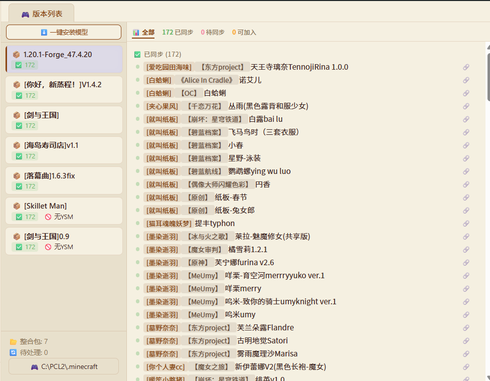
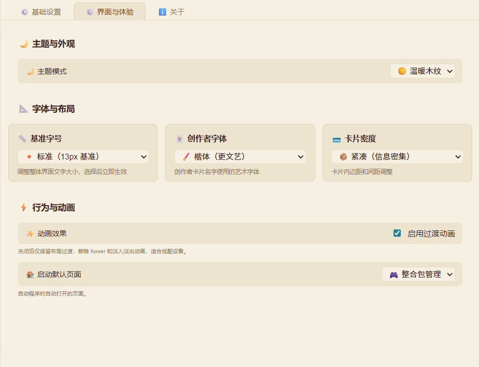

# 🧱 YSM 模型管理器

> 像 Steam 创意工坊一样，管理你的 Minecraft YSM 模型。导入、预览、分类、同步到整合包，一站完成。

**技术栈**：Go (Wails v3) + 原生 HTML/CSS/JS (Web Components + Shadow DOM) + Three.js + YSMParser WASM

**平台支持**：✅ Windows (amd64) · ⚠️ macOS (实验性) · ❓ Linux (待验证)

---

## 站点地图

| 入口 | 说明 |
|------|------|
| 📚 [用户指南](./guide/index.md) | 按功能讲解入口路径与操作步骤，共 16 篇 |
| 📐 [架构决策（ADR）](./adr/index.md) | 决策真相源，按状态分组可锚点跳转 |
| 🧠 [知识卡](./knowledge/index.md) | 面向 AI 与开发者的模块知识卡索引 |
| 📦 [发版记录](./releases/README.md) | 各版本发布说明 |
| 🖥️ [网页版（预留）](./app/index.md) | 未来 Web 版入口占位，当前以桌面应用为主 |

> 📥 **下载**：[GitHub Releases](https://github.com/eghrhegpe/ysm-model-manager/releases) · 📖 **源码**：[GitHub 仓库](https://github.com/eghrhegpe/ysm-model-manager)

---

## 🖥️ 功能一览

左侧导航 → 右侧主区域，共 7 个功能模块：

| 导航 | 功能 |
|------|------|
| 📦 模型仓库 | 树形浏览、启用/禁用、搜索排序、3D 预览 |
| 🎮 整合包管理 | 版本列表、同步状态、快捷安装 |
| 🎨 创作者频道 | 创作者浏览、渐变头像、预设搜索、内嵌浏览器 |
| 🧩 创意工坊 | GitHub 在线仓库列表、一键下载 |
| 👴 仓库元老 | 健康度评分、资历最深、月度热力图、今日推荐 |
| 🛠️ 诊断与冲突 | 操作日志、模型去重（可选保留）、冲突检测 |
| ⚙️ 设置 | 卡片化设置、"关于"主页、主题与字体配置 |

---

## 📸 界面预览

---

## 🚀 快速开始

1. **下载**：前往 [GitHub Releases](https://github.com/eghrhegpe/ysm-model-manager/releases) 下载最新 `YSM-Model-Manager_windows_amd64.zip`
2. **解压**：解压到任意目录（如 `D:\YSM-Model-Manager\`）
3. **首次配置**：启动程序 → 设置游戏根目录（`.minecraft` 文件夹）→ 设置模型仓库路径
4. **开始使用**：把模型文件放入仓库目录，或通过拖拽导入

> 📖 详细操作见 [用户指南](./guide/index.md)

---

## 🧭 开发者入口

| 目的 | 去处 |
|------|------|
| AI 协作规则 | [AGENTS.md](../AGENTS.md) |
| 架构决策记录（ADR） | [决策记录（ADR）](./adr/index.md) |
| 知识卡索引 | [知识卡索引](./knowledge/index.md) |
| 发版记录 | [版本发布说明](./releases/README.md) |
